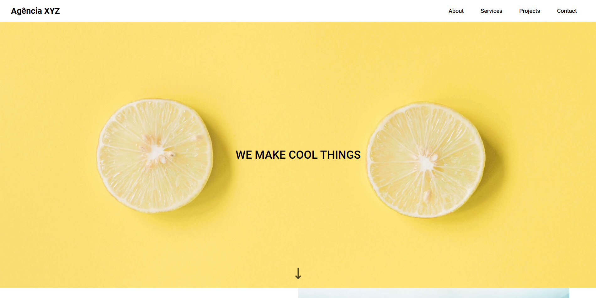
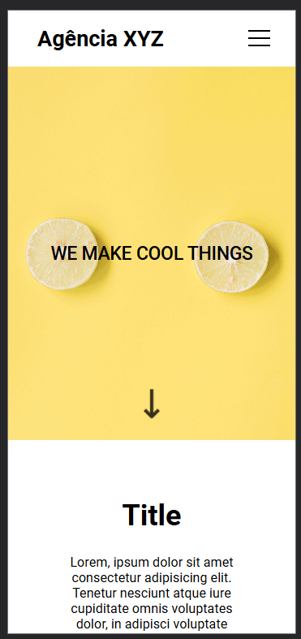

## Índice

- [Visão geral](#visão-geral)
- [Captura de tela](#captura-de-tela)
- [Meu processo](#meu-processo)
- [Criado com](#criado-com)
- [O que aprendi](#o-que-aprendi)
- [Desenvolvimento contínuo](#desenvolvimento-continuo)
- [Autor](#autor)
- [Agradecimentos](#agradecimentos)

## Visão geral

### Captura de tela

## Meu processo

### Criado com

- HTML5 semântica
- CSS
- Flexbox
- Grid

### O que aprendi

Aprendi a importancia de manter os elementos bem visiveis e organizados na tela. Uma página criada assim chama bastante a atenção e reflete boa organização pelo desenvolvedor.
Também vale ressaltar que a responsividade está excelente, o que torna o site bem prático e rápido no celulares.

### Desenvolvimento contínuo

Preciso continuar a usar o first mobile para desenvolver melhor minhas tecnicas de adaptação de diferentes layouts.

## Autor

- Site - [Mário Carlaibe](https://github.com/MarioCarlaibe)
- Mentor de front-end - [@MarioCarlaibe](https://www.frontendmentor.io/profile/MarioCarlaibe)

## Agradecimentos

Agradeço ao DevQuest pelo conhecimento adquirido e as instruções fornecidas.